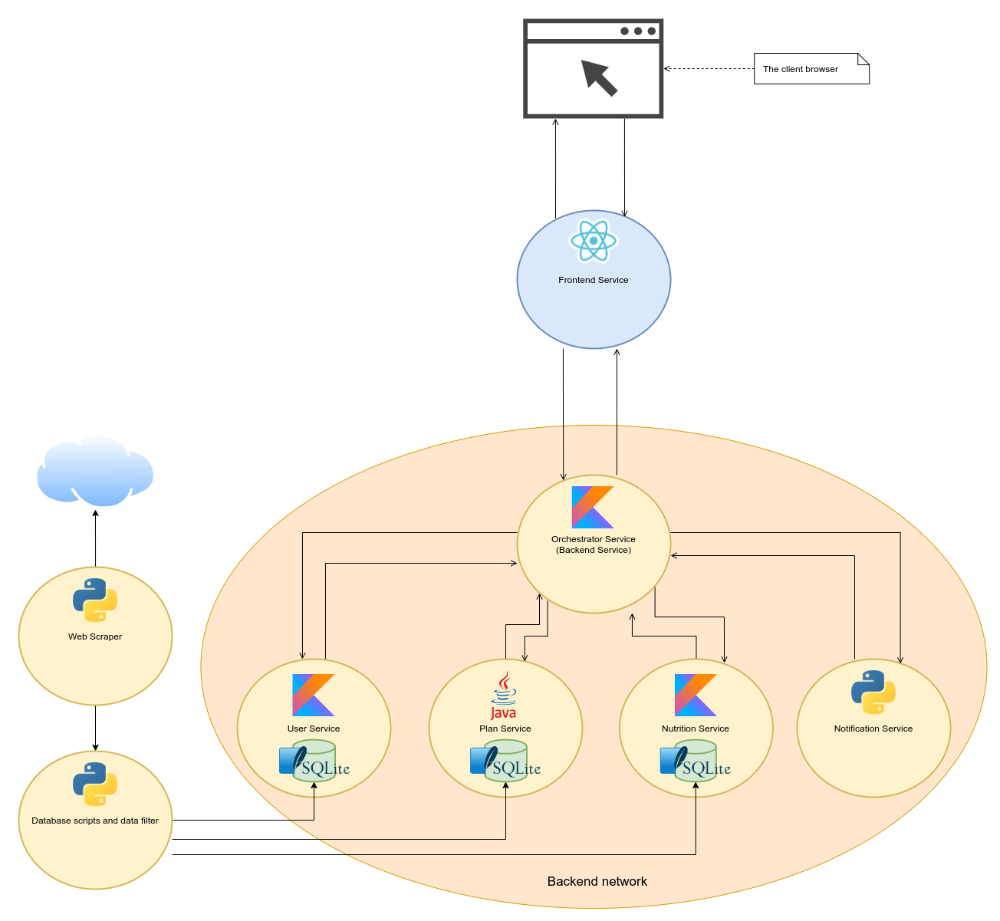
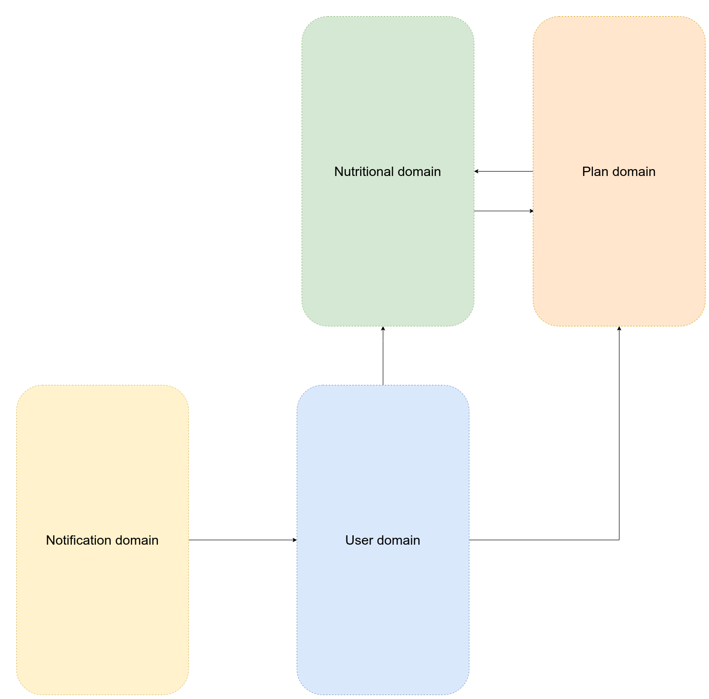
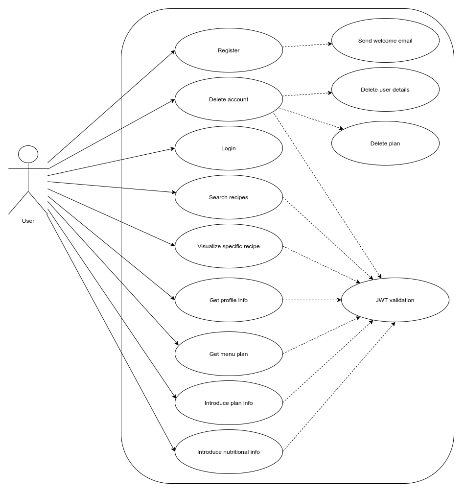

# Keep fit

Keep fit tries to implement a web platform which helps users keep track of their nutritional intake. It is implemented based on a MSA(microservice architecture) and ready to be deployed with Docker containers.

The website contains a large database of recipes from www.ambitiouskitchen.com and www.bbcgoodfood.com. Those are available to either create a meal plan for a user or just search through.

## Getting Started

### Software architecture implemented
As stated before, the project is based on MSA (microservice architecture), resulting 6 services:
* __User service__ - this service is responsible for user data and JWT creation and validation.
* __Plan Service__ - plan service stores all the data about user's meal plans. The association is made by referring the __user ID__ from _User Service_ and __recipe ID__ from _Nutrition Service_.
* __Notification Service__ - it implements an SMTP client and using a public SMTP server sends emails to users based on their registration data. 
* __Nutrition Service__ - the service contains all data about recipes: __nutritional information__, __recipes general information__ and __recipes images__
* __Orchestrator Service__ - as the orchestrator pattern from SOA(service oriented architecture.)
* __Frontend Service__ - the first service that users interact with. It contains all the data about the web portal, basically the web pages and their associated logic. 

A visual representation of those services for a better understanding.

Even with this separation of business logic, it is debatable if those services are indeed an implementation of MSA. Some of those services are still not granular enough. It can be split further into more granular services.

__Ex__: User Service implements authentication and authorization along with CRUD operations for user data. Based on the MSA the authorization and authentication can be implemented as a new services with has this only one job.

In the diagram representation above, it can be noticed some more components which are not yet mentioned. Those are:
* __Web scraper script__
* __Database scripts and data filter__
* __SQLite database__

### Data persistence

As a data persistence solution, __SQLite__ was a good fit not only for its lightweight usages but also is a good fit for a true MSA solution. Those database files are integrated in their each proprietary service. By those means there is a better isolation between data.

It needs to be mentioned that this solution does not provide a good replication and distributed database solution.

### Web scraping

The project also includes Python3 scripts which do the Web scraping and data processing part. The Web scraping script implemented using __Selenium__ accesses a list of source urls, scrapes each recipe url then using multiprocessing extracts all the necessary data with a Python package called __recipe_scrapers__.

Those extracted data must follow a refinement process in which the necessary data is transformed in a way that fits platform needs.

### More about architecture

This implementation was developed based on __DDD(domain driven design)__ ideology which supports developing software based on the business models and create a __ubiquitous__ language.

The above representation indicates the system domain bound contexts and their way of interaction.

### Toolstack

As programming languages used for developing this project, the stack is:

* __Kotlin__ - developing backend services
* __Python__ - developing backend service and implementing data acquisition scripts
* __Java__ - developing backend service
* __Typescript__ - used for developing Frontend code along with React.js library

All the service stack is configured to run on Docker and Docker compose. This way it does not require any configuration on the local machine beside installing Docker and creating the Docker images from __Dockerfiles__.

## Postman testing routes

For testing the application there is a Postman collection created and stored as JSON file in the _Documentation_ folder

## How to run the project

* A local machine running whatever OS. (Linux/Windows/Mac OS)
* Installing docker on the local machine.
* Running the Dockerfiles for each service.
* Run the Docker compose configuration for an easier management.
* Access the app and test its features.

## Use case diagram

The use case diagram contains a big picture about the application functionalities and general workflow.

## More details

There will be included a README file for each service for a better understanding and representation of technical details.

## Authors

### Gabriel Strilciuc
[Linkedin](https://www.linkedin.com/in/strilciuc-g-288153100/)

## License

This project is licensed under the __MIT License__ - see the LICENSE.md file for details
